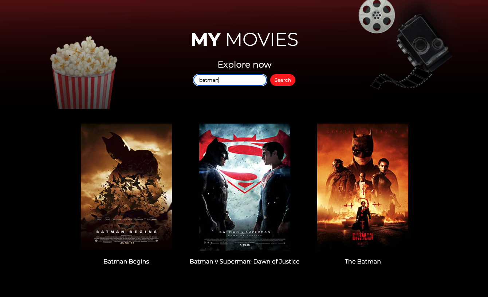
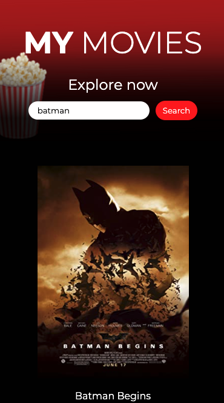
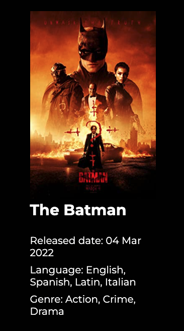

# My Movies
> This project allows you to search movies and get detail information of each movie (using OMDB API).

## Table of Contents
* [General Info](#general-information)
* [Technologies Used](#technologies-used)
* [Features](#features)
* [Screenshots](#screenshots)
* [Setup](#setup)
* [Room for Improvement](#room-for-improvement)
* [Acknowledgements](#acknowledgements)
* [Contact](#contact)

## General Information
- This project was created to search for your favorite movies and get more information about them, such as description, release date, genre and language.

## Technologies Used
- Angular 14 - Framework used in the project;
- Rxjs - To exchange information between components;
- Karma - To create tests for the project.

## Features
- Search for movies by title;
- Click on an movie and get a movie details page.

## Screenshots

## Setup
Prerequisites:

- NodeJS ( You can install the LTS version - https://nodejs.org/en/ );
- Editor ( VSCode );
- Angular ( Install the Angular CLI globally, you can run the command: npm install - g @angular/cli );

How to start?
- Open the project in your machine;
- Replace the 'API_KEY' inside the 'movie.service.ts' document with one generated on the OMDb API website: https://www.omdbapi.com/ ;
- Inside the project root run the following commands: 

	npm intall
	npm start

- You can access the app on port 4200 'http://localhost:4200/main' .

## Room for Improvement
Room for improvement:
- Create tests for routing;
- Solve the loader problem on the details page;

To do:
- Change the page title displayed in the browser tab;
- Add custom favicon;

## Acknowledgements
- This project was created using OMDb API;
- This project was created using this tutorial to start the project: https://medium.com/bb-tutorials-and-thoughts/how-to-get-started-with-angular-c3c209d6fe90 .

## Contact
Created by [@camilahorita](https://camilahorita.github.io/portfolio/) - feel free to contact me!